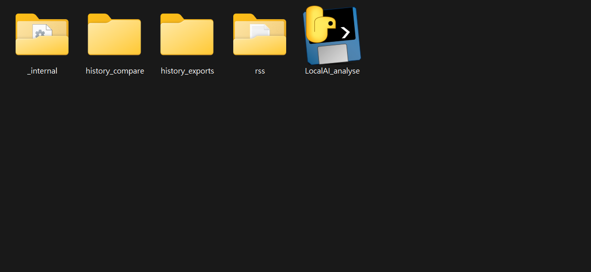

  

# LocalAI_Analyzer
A browser extension that uses local models for offline data analysis, converting web browsing history into personal interest labels to support personalised content recommendations.

    
  </a>

## Dowload:
### Browser_extension: [🔗Link](https://drive.google.com/drive/folders/19L_4yPwL5UBmnd_i-g22QqQ5pGPtXnSj?usp=drive_link)

### Backend （Mac）:[🔗Link](https://drive.google.com/drive/folders/1fOTmFW8-qO8_eq2RZ0VW3gkd2RWTZ7iH?usp=drive_link)

### Backend （Windows）:[🔗Link](https://drive.google.com/drive/folders/1H2T7Zp49r7JaXkyLdZ6qC29JDV4I8QiK?usp=drive_link)

##  Installation:
#### Since the project is currently in testing, it does not support installation from the extension store yet. Please download the extension package and install it locally.

### 1️⃣ Enable Developer Mode in your browser and load the extension package locally.

### 2️⃣ Open the local backend system(LocalAI Analyse)

#### Mac

#### Win

### 3️⃣ Self-check & local connection

## How to Use：

### ➡️ Launch panel
Open the local backend system and establish a communication connection

  
  

### ➡️ Setting page
#### Analysis Setting
Adjust the analysis range of historical data, and set the number and levels of personalised tags.

Choose whether to enable deep analysis (using BeautifulSoup to scrape page content) and set a website blacklist.

#### Personalized Recommendation Setting
Choose whether to enable personalized recommendations.

Build a personal article library, subscribe to RSS sources, and enable auto-updates.

Manually update or delete the local article library

### ➡️ Personalized Labels
Add custom topic tags, and the system will display related content on the recommendation page.

Adjust the weight of different tags, and the system will modify the number of recommendations based on their relevance.

Restore deleted tags

Restore to the system-generated tag state

### ➡️ Personalized recommended content

Enable personalized content recommendations

  
  

The system recommends content based on your personal interest tags, and all recommended articles come from your subscribed sources.

