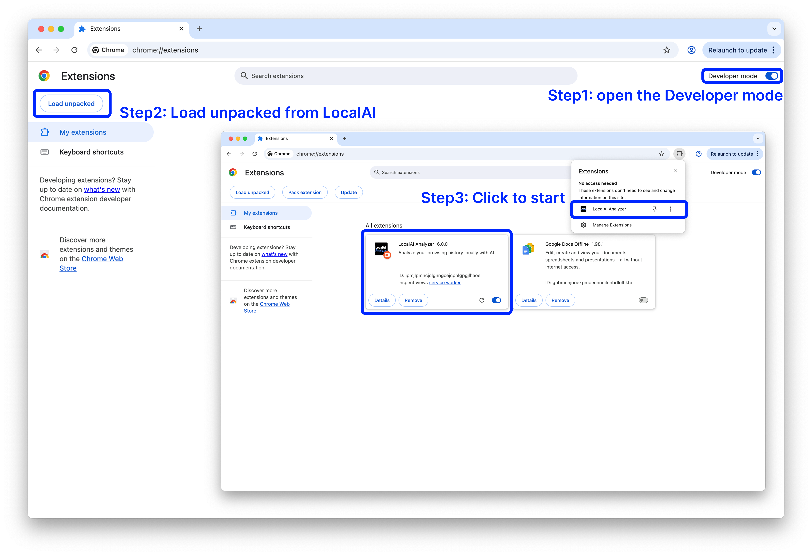

  

# LocalAI_Analyzer
A browser extension that uses local models for offline data analysis, converting web browsing history into personal interest labels to support personalised content recommendations.

    
  </a>

## Dowload:
### Browser_extension: [🔗Link](https://drive.google.com/drive/folders/1uS9LyoyJMPp-Z9rMY7-QuZVTenEHB4Pr?usp=drive_link)

### Backend （Mac）:[🔗Link](https://drive.google.com/drive/folders/1fOTmFW8-qO8_eq2RZ0VW3gkd2RWTZ7iH?usp=drive_link)

### Backend （Windows）:[🔗Link](https://drive.google.com/drive/folders/1H2T7Zp49r7JaXkyLdZ6qC29JDV4I8QiK?usp=drive_link)

##  Installation:
### Since the project is currently in testing, it does not support installation from the extension store yet. Please download the extension package and install it locally.

### Enable Developer Mode in your browser and load the extension package locally.

## How to Use：